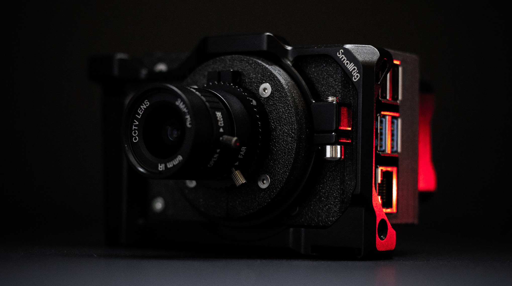
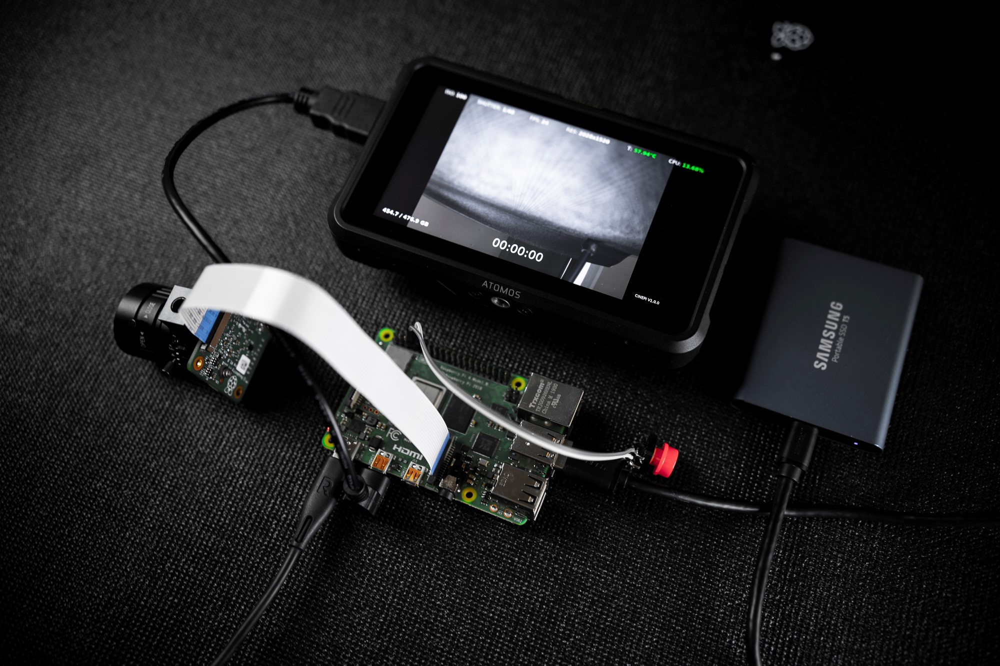

# CinePI 


Software to enable Cinema Camera capabilities for Raspberry Pi 
&nbsp;



&nbsp;
# Software Overview

Description of the software side of the camera which involve multiple layers of logic/configuration at the application ( userspace ) and kernel level. 

&nbsp;

***
## **Architecture**:
This section will highlight the logic responsible for dealing with the RAW frames streamed from the image sensor. 

```
V4L2 ( Unicam ) -> V4L2Copy -> V4L2 Loopback Device -> yavtad/rawcam  -> live_view_display
                                                    -> yavtar2/rawcam -> save_dng_frames 
```

### **V4L2 Loopback** 
V4L2 Loopback is used to create a virtual V4L2 device that will act as the source for our RAW frames. 
V4L2 Loopback allows for multiple applications to access the same device at the same time and in this way acts a "poor-mans multi-threaded" experience where we can have say one application access the RAW frames for live view and a seperate application access the same RAW frames for saving to disk. This way one will not necessearily affect the other and they stay independant* ( conceptually this is what I expected but in practice this is not necessarily true and comes with quirks. **This is not the way to implement actual multi-threading so simply acts a temporary solution for the time being.** )

&nbsp;

### **V4L2Copy ( V4L2Utils)**
V4L2Utils comes bundled with a very handy utility V4L2Copy that as it's name might suggest, can copy the data from one V4L2 device to another. This is used to copy data from the original camera V4L2 source ( /dev/video0 ) to our new virtual V4L2 device ( /dev/video4 ). 

&nbsp;

### **Yavta ( 6by9 fork )**
This specific application is where the actual processing of RAW frames happens. This forked version was tuned to work the Raspberry Pi High Quality Camera and in this particualr project is used in two parts:
1. **yavtad/rawcam | Live view Display:** This application is modified to specifically handle the rendering of RAW frames to the display ( HDMI ) and has all the necessary MMAL settings to create a proper live view. ( Gamma, CCM, etc.. )

2. **yavtar2/rawcam | RAW Frame Recorder:** This application is modified specifically to handle the saving of RAW frames to disk. Also handles the GPIO logic for start/stop trigger and live timecode display. 

&nbsp;

### Summary: V4L2Copy is used to pipe RAW frames from the original V4L2 device to our new virtual V4L2 Loopback device. Two seperate instances of Yavta are used to read RAW frames from our virtual device to perform liveview and recording capabilities. 

&nbsp;

&nbsp;
***

## **Main process**:
The section will highlight the main process that is spawned at bootup. It is responsible for further spawning and managing of 3 sub-processes that comprise of the entire camera system. 
```
camera/cameracore3.py   -> camera/cameracore2.py ( configures VL42 and starts both yavta instances)
                        -> controls-thread/bmdproxy.py ( bluetooth service )
                        -> mmal_render_ui/render ( live_view overlays )
```

### **cameracore3**
This python script is responsible for spawning the 3 main sub-processes necessary for the entire camera system. This script is called at bootup via rc.local 

### **cameracore2**
This python script is responsible for spawning and managing the both the live-view and frame recording yavta instances based on current frame dimensions. 

### **bmdproxy**
This python script initializes the BLE server that implements logic that allows it to interface with applications that use the Blackmagic Camera Control Protocol over bluetooth. 

### **mmal_ui_render**
This application implements the logic to read/update/draw the necessary live view settings overtop of the live view image. 

&nbsp;



# Hardware Overview

Coming soon...
