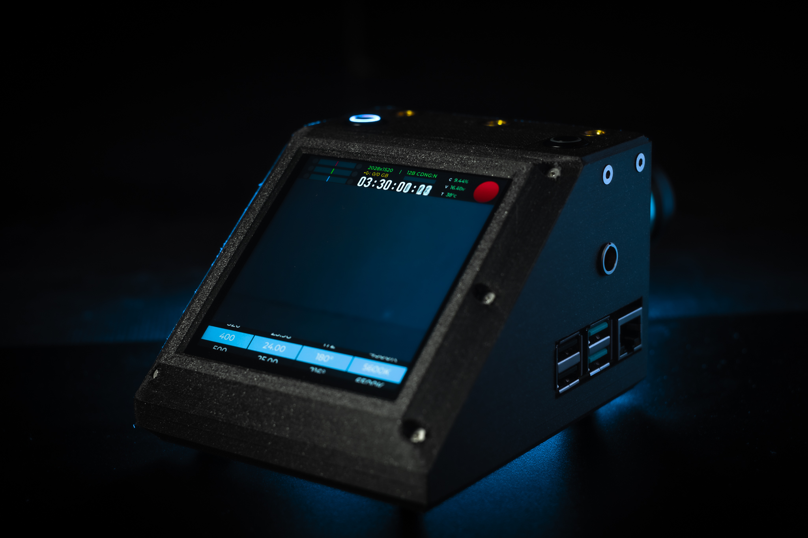

# CinePI V2: OpenSource Cinema Camera using Raspberry Pi

&nbsp;

# Introduction

The CinePI V2 is an OpenSource Camera design utilzing off-the-shelf / DIY hardware & software from vendors including: Raspberry Pi, Pimoroni, Adafruit, Sparkfun, etc...

The purpose of this repository and it's accomanying resocures is primarly to act as a template / starting point for your own design. CAD files are included for you to modify the enclosure to your needs, feel free to experiment with the parts used; use a different set of buttons, RTC, display, etc... the only components that cannot be changed are the Raspberry Pi 4B and the High Quality Camera Module. 

> ## Notice 
> 
> This design makes a number of modifications to hardware, as such is not recommended for those not comfortable with a soldering iron.
> 
> Warranties may be void. I am not responsible for any damages that accompany hardware modifications. 

# Features

- 4.0" High Res Touch Screen Interface
- Internal High Capacity Battery 
- Real time clock 
- USB 3.0 External SSD Recording
- 1/4" Mounting Points
- 40mm Noctua Cooling System 

# Guide

Refer to the Wiki section for in-depth guide on hardware assembly and software installation. 

# References

CinePI Project Account | [Github Page](https://github.com/cinepi)

